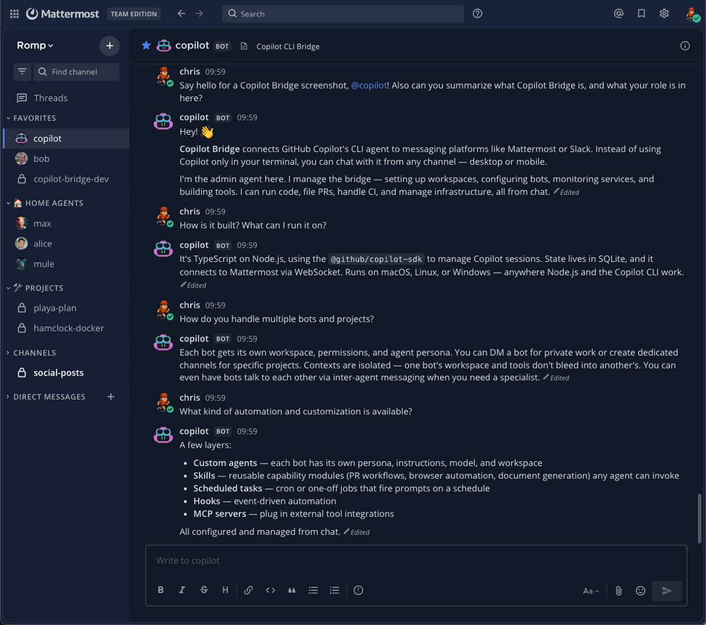

# copilot-bridge

<div align="center">

</div>

Bridge GitHub Copilot CLI to messaging platforms. Send messages from Mattermost (or other platforms) and get responses from Copilot sessions running on your machine.

> [!WARNING]
> This is all experimental.

```
Mattermost Channel → copilot-bridge → @github/copilot-sdk → Copilot CLI
     ↑                                                          ↓
     └──────────── streaming response (edit-in-place) ←─────────┘
```

## Screenshots



More screenshots [here](docs/screenshots.md).

## Features

- **Multi-bot support** — Run multiple bot identities on the same platform (e.g., `@copilot` for admin, `@alice` for tasks)
- **Workspaces** — Each bot gets an isolated workspace with its own `AGENTS.md`, `.env` secrets, and `MEMORY.md`
- **DM auto-discovery** — Just message a bot; no channel config needed for direct messages
- **Streaming responses** — Edit-in-place message updates with throttling
- **MCP & skills** — Auto-loads MCP servers and skill directories from Copilot config
- **Fuzzy model matching** — `/model opus` resolves to `claude-opus-4.6` (mobile-friendly)
- **Interactive permissions** — Approve/deny tool use via chat, or `/autopilot` for full autonomous mode
- **Model fallback** — Automatic fallback to alternative models on capacity/availability errors
- **Loop detection** — Detects and breaks tool call loops with user notification
- **Session management** — `/reload` to refresh config, `/resume` to switch between sessions (prefix matching supported)
- **Persistent preferences** — Model, agent, verbose mode, permissions saved per-channel
- **Scheduled tasks** — Recurring (cron) and one-off (datetime) tasks per channel
- **Inter-agent communication** — Bot-to-bot messaging via `ask_agent` tool
- **File sharing** — `send_file` and `show_file_in_chat` tools for pushing files to chat
- **Attachment ingestion** — File and image attachments are extracted and passed to the session
- **Mid-turn steering** — Send messages while the bot is working to redirect it
- **Streamer mode** — Hide preview/internal models from `/model` list for on-air use
- **Thread-aware replies** — Reply in threads via 🧵 trigger or per-channel config
- **Config hot-reload** — `/reload config` applies safe changes without restarting the bridge
- **Admin onboarding** — Templates and tools for creating channels, managing workspaces

## Quick Start

1. **Prerequisites**: Node.js 20+, GitHub Copilot CLI installed and authenticated
2. **Install** (pick one):
   - **npm**: `npm install -g @chrisromp/copilot-bridge`
   - **From source**: `git clone https://github.com/ChrisRomp/copilot-bridge.git && cd copilot-bridge && npm install`
3. **Configure**: `copilot-bridge init` (or `npm run init` from source) — interactive wizard
4. **Validate**: `copilot-bridge check` (or `npm run check`)
5. **Run**: `copilot-bridge start` (or `npm run dev` for development with watch mode)

For DMs, that's it — the bridge auto-discovers DM channels for each bot. For group channels, add a `channels` entry mapping the channel ID to a working directory. See the [Setup Guide](docs/setup.md) for the full walkthrough or [Configuration](docs/configuration.md) for reference.

### Running as a service

See the [Setup Guide — Running as a Service](docs/setup.md#running-as-a-service) for macOS (launchd) and Linux (systemd) instructions, or run `copilot-bridge install-service` to install automatically.

## Chat Commands

| Command | Aliases | Description |
|---------|---------|-------------|
| **Session** | | |
| `/new` | | Start a fresh session |
| `/stop` | `/cancel` | Stop the current task |
| `/reload` | | Reload session (re-reads AGENTS.md, workspace config) |
| `/reload config` | | Hot-reload config.json (safe changes apply without restart) |
| `/resume [id]` | | List past sessions, or resume one by ID |
| `/model [name]` | `/models` | List models or switch model (fuzzy match) |
| `/agent <name>` | | Switch custom agent (empty to deselect) |
| `/reasoning <level>` | | Set reasoning effort (`low`/`medium`/`high`/`xhigh`) |
| `/context` | | Show context window usage |
| `/verbose` | | Toggle tool call visibility |
| `/status` | | Show session info |
| **Permissions** | | |
| `/approve` / `/deny` | | Handle pending permission request |
| `/always approve` | `/remember` | Approve + persist the permission rule |
| `/always deny` | | Deny + persist the permission rule |
| `/rules` | `/rule` | List saved permission rules |
| `/rules clear [spec]` | | Clear rules (all, or by spec) |
| `/yolo` | | Toggle auto-approve permissions |
| `/autopilot` | | Toggle autopilot mode (autonomous loop, implies yolo) |
| **Planning** | | |
| `/plan` | | Toggle plan mode (structured planning before implementation) |
| `/plan show` | | Display the current plan |
| `/plan clear` | | Delete the plan |
| **Scheduling** | | |
| `/schedule` | `/schedules`, `/tasks` | Manage scheduled tasks (list, cancel, pause, resume, history) |
| **Tools & Info** | | |
| `/skills` | `/tools` | Show available skills and MCP tools |
| `/mcp` | | Show MCP servers and their source |
| `/streamer-mode` | `/on-air` | Toggle streamer mode (hides preview/internal models) |
| `/help` | | Show common commands; `/help all` for full list |

## Documentation

- **[Configuration](docs/configuration.md)** — Platforms, channels, permissions, defaults
- **[Workspaces & Agents](docs/workspaces.md)** — Workspace system, .env secrets, templates, agent onboarding
- **[Architecture](docs/architecture.md)** — Source layout, message flow, adapter pattern, persistence

## License

MIT
